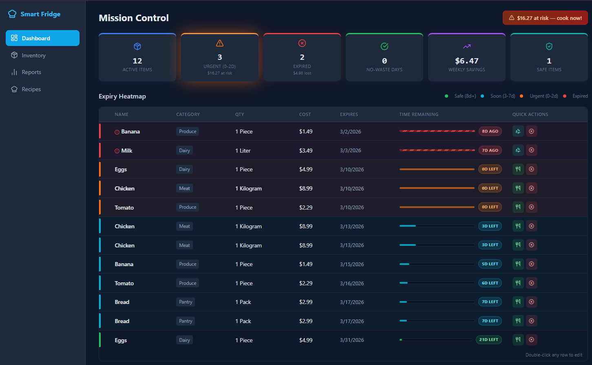
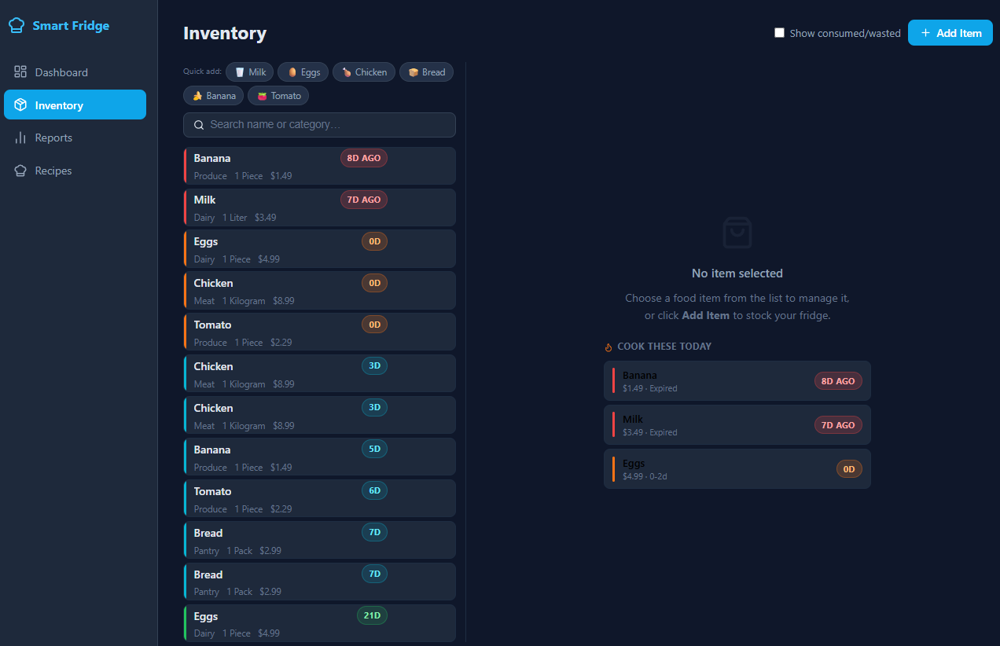
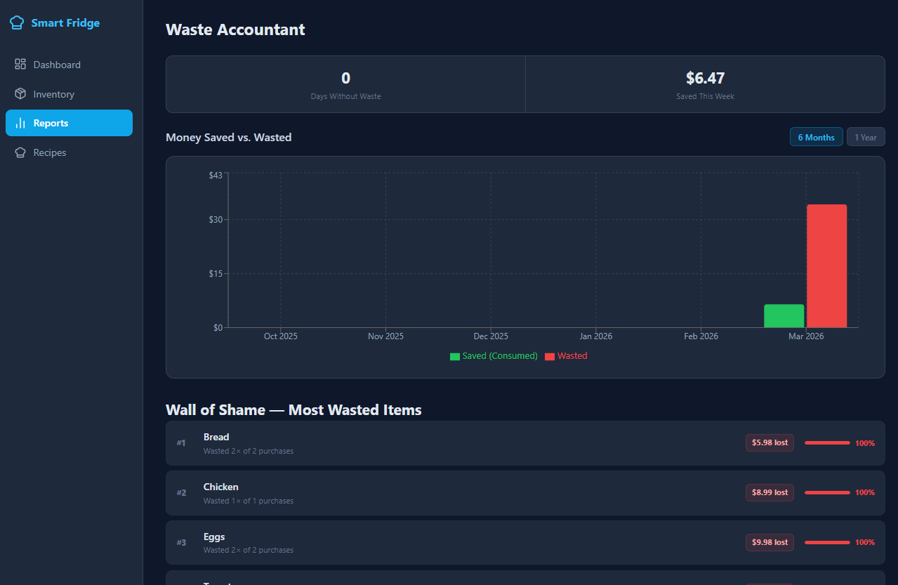
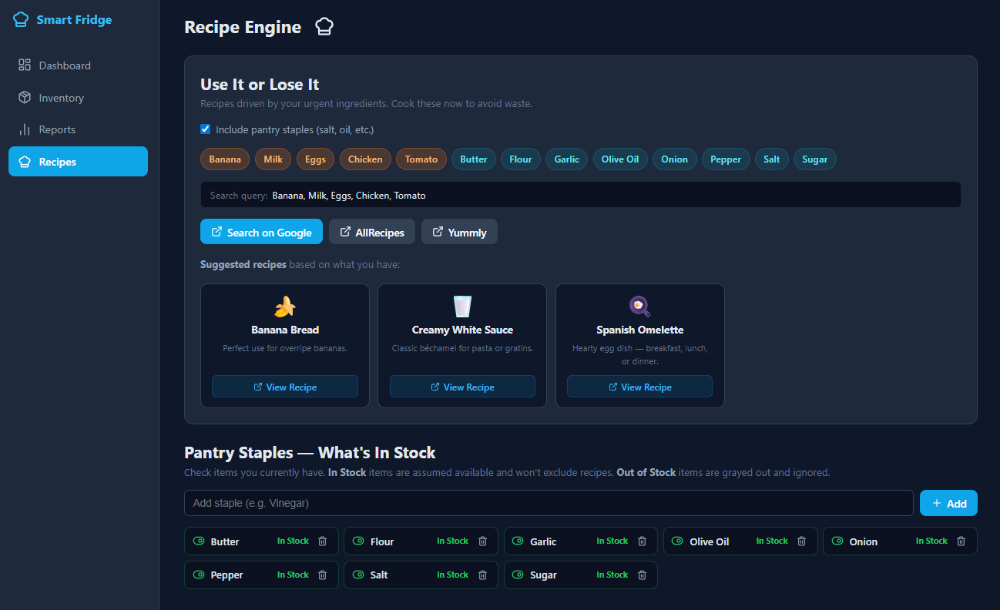

# Smart Fridge — Recipe Engine

A full-stack **food waste reduction app** built with **.NET 10 + React 18**. Track grocery expiry dates, get cost-aware waste analytics, and receive smart recipe suggestions before food goes bad.

---

## Screenshots

### Dashboard — Mission Control

> KPI cards with urgency glow, 4-color expiry heatmap, hazard icons for expired items, quick Consumed / Compost / Wasted actions.

### Inventory — Master-Detail

> Locked scrollable item list, quick-add presets, "Cook These Today" suggestions in the empty detail pane.

### Reports — Waste Accountant

> Bar chart with 6-month / 1-year toggle, Wall of Shame ranked by value lost, monthly Net breakdown.

### Recipe Engine

> Smart suggestion cards auto-matched to urgent ingredients, pantry staples In Stock checklist, one-click Google / AllRecipes / Yummly search.

---

## Tech Stack

| Layer | Technology |
|---|---|
| Backend | .NET 10 · ASP.NET Core · EF Core 10 · SQLite |
| Frontend | React 18 · TypeScript · Vite 7 |
| Charts | Recharts |
| Icons | Lucide React |
| HTTP | Axios |
| Architecture | Clean Architecture (Domain → Application → Infrastructure → WebAPI) |

---

## Features

### 🌡️ Expiry Heatmap (Dashboard)
- 4-level urgency system: **Safe** (8d+) · **Soon** (3-7d) · **Urgent** (0-2d) · **Expired**
- Color-coded progress bars — urgent bars pulse, expired bars show a hazard stripe
- KPI cards: active items, urgent count, at-risk value, no-waste days, weekly savings, safe count
- Urgent KPI card glows when items need attention
- Double-click any row to edit inline

### 📦 Inventory (Master-Detail)
- Scrollable item list locked to viewport height — header always visible
- **Quick-Add presets**: one-click add Milk, Eggs, Chicken, Bread, Banana, Tomato with sensible defaults
- **Price Memory**: typing an item name auto-fills last known price, unit, and expiry (debounced, 600ms)
- **Bulk Mode**: form stays open after each add for rapid data entry
- Search by name or category
- Expired items show a **Compost** button (teal Recycle icon) instead of Consumed
- **Undo** snackbar after every Consumed / Wasted action (3-second window)
- Detail pane shows **"Cook These Today"** list when nothing is selected

### 📊 Waste Accountant (Reports)
- Bar chart: Money Saved vs. Wasted with **6-month / 1-year toggle**
- Y-axis auto-scales to data (`max × 1.25`) with `$` currency labels
- Monthly breakdown table with Net column (`+$X` / `-$X`)
- **Wall of Shame**: most wasted items ranked by frequency and total value lost
- Savings milestone tracker with streak badge

### 🍳 Recipe Engine
- Ingredients from urgent items drive the search query (most urgent first)
- **Smart recipe suggestion cards** — 15 ingredient-to-recipe mappings (Chicken, Milk, Eggs, Beef, Salmon, Tomato, Banana, Potato, Spinach, Rice, Pasta, Pork, Apple, Carrot, Onion)
- One-click search on Google, AllRecipes, or Yummly
- **Pantry Staples** checklist with In Stock / Out of Stock toggle — included in search query when enabled

### 🔔 Notifications
- **Welcome toast** on app load: alerts you to expiring items and at-risk dollar value
- **Savings toast**: "Great job! Chicken consumed — $8.99 saved." after consuming an item
- **Undo toast**: clickable Undo button for 3 seconds after any status change
- **Price-from-history badge**: appears in the Add form header when suggestion auto-filled

---

## Testing

### Run all tests

```bash
# Backend unit tests (26 tests)
dotnet test tests/SmartRecipeEngine.Tests/

# Frontend unit tests (16 tests)
cd client && npm test

# E2E tests — requires the app to be running (start-dev.bat)
cd e2e && npm test
```

### Backend — xUnit (`tests/SmartRecipeEngine.Tests/`)

Uses **xUnit** + **Moq**. Tests run in isolation with mocked repositories — no database required.

| File | Coverage |
|---|---|
| `FoodItemEntityTests` | `IsExpired`, `IsUrgent`, `IsSoon`, `IsSafe`, `DaysRemaining` edge cases across all urgency boundaries |
| `FoodItemServiceTests` | Status changes create waste records; `Active` change does not; auto-cleanup only marks items expired > 3 days; price history upserted on create |
| `ReportServiceTests` | Dashboard item counts; weekly savings filter (consumed only, last 7 days); monthly report periods (6 and 12 months); savings milestone threshold (7-day streak) |

### Frontend — Vitest (`client/src/__tests__/`)

Uses **Vitest** + **jsdom**. Pure utility tests, no API calls.

| File | Coverage |
|---|---|
| `format.test.ts` | `formatCurrency`, `formatCurrencyCompact` (K/M/B abbreviations, NaN/Infinity guard), `formatPct`, `URGENCY_COLOR`, `URGENCY_LABEL` |

### E2E — Playwright (`e2e/tests/`)

Uses **Playwright** (Chromium). Spins up the Vite dev server automatically; requires the .NET API running separately.

| File | Scenarios |
|---|---|
| `dashboard.spec.ts` | Page title, Mission Control heading, KPI cards visible, Expiry Heatmap section, all sidebar nav links |
| `inventory.spec.ts` | Inventory heading, Add Item button, quick-add presets, search input, empty-pane message, add form opens, search filter hides rows, sidebar navigation to Reports and Recipes |

### CI/CD — GitHub Actions (`.github/workflows/ci.yml`)

Runs automatically on every **pull request** and **push to master**:

```
PR / push to master
├── backend-tests    → dotnet test  (26 tests, no DB needed)
├── frontend-tests   → vitest run   (16 tests)
└── e2e-tests        → playwright   (runs after both above pass)
      starts .NET API + Vite dev server
      uploads HTML report as artifact on failure
```

---

## Project Structure

```
smart-recipe-engine/
├── src/
│   ├── SmartRecipeEngine.Domain/          # Entities, enums, interfaces
│   ├── SmartRecipeEngine.Application/     # DTOs, services, use cases
│   ├── SmartRecipeEngine.Infrastructure/  # EF Core, SQLite, repositories, migrations
│   └── SmartRecipeEngine.WebAPI/          # ASP.NET Core controllers, DI, static file hosting
├── tests/
│   └── SmartRecipeEngine.Tests/           # xUnit + Moq unit tests (26 tests)
├── client/                                # React + TypeScript frontend (Vite)
│   └── src/
│       ├── __tests__/    # Vitest unit tests (16 tests)
│       ├── api/          # Axios API clients
│       ├── components/   # FoodItemForm
│       ├── pages/        # Dashboard, Inventory, Reports, Recipes
│       ├── types/        # Shared TypeScript types & constants
│       └── utils/        # formatCurrency, urgency color maps
├── e2e/                                   # Playwright E2E tests
│   └── tests/            # dashboard.spec.ts, inventory.spec.ts
├── .github/workflows/ci.yml               # GitHub Actions CI/CD
├── start-dev.bat                          # Launch both servers
└── SmartRecipeEngine.slnx
```

---

## Getting Started

### Prerequisites
- [.NET 10 SDK](https://dotnet.microsoft.com/download)
- [Node.js 20+](https://nodejs.org/)

### Run in Development

```bat
start-dev.bat
```

This opens two terminals:
- **API** → `http://localhost:5000` (auto-migrates SQLite on first run)
- **React dev server** → `http://localhost:5173`

The database is created automatically at `%LocalAppData%\SmartRecipeEngine\app.db` and seeded with default pantry staples.

### Build for Production

```bash
# Build frontend (output goes to WebAPI/wwwroot)
cd client && npm run build

# Build backend
dotnet build

# Run (serves the React SPA + API on one port)
dotnet run --project src/SmartRecipeEngine.WebAPI
```

### Reset the Database

```bash
rm "$LOCALAPPDATA/SmartRecipeEngine/app.db"
```

Restart the API — EF Core will recreate and re-seed the database.

---

## Data Validation

All food item costs are capped at `$9,999.99` via `[Range]` validation on the DTOs, preventing garbage data from corrupting financial aggregates.

---

## Urgency Levels

| Level | Days Remaining | Color | Bar Effect |
|---|---|---|---|
| Safe | 8+ | Green | Solid |
| Soon | 3–7 | Cyan | Solid |
| Urgent | 0–2 | Orange | Pulsing |
| Expired | < 0 | Red | Diagonal stripe |
